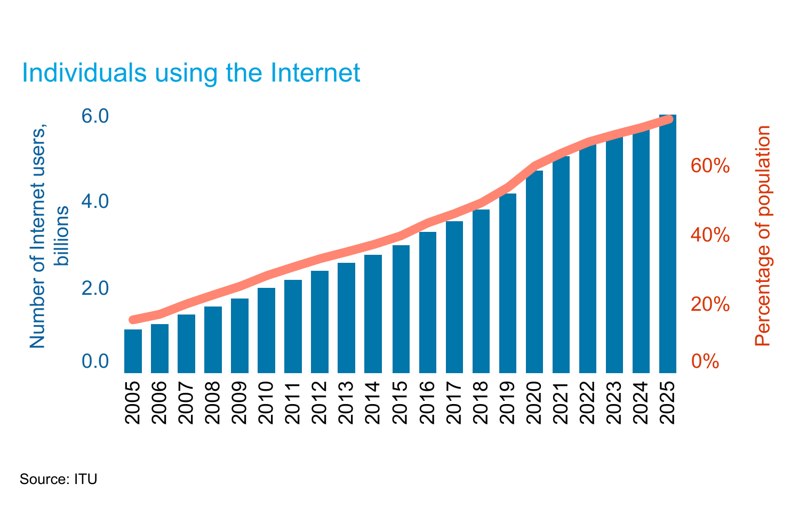
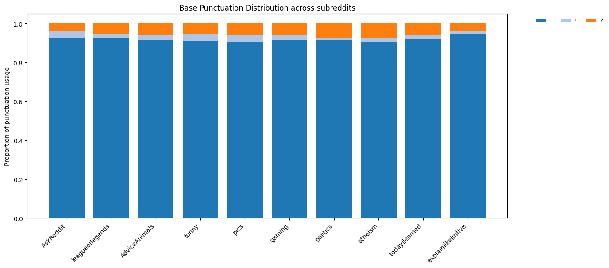
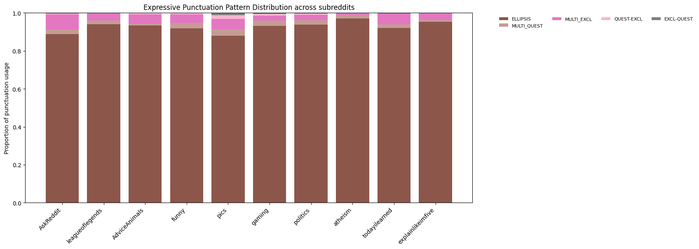
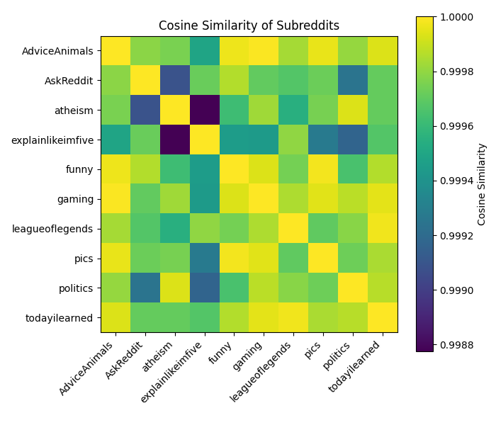
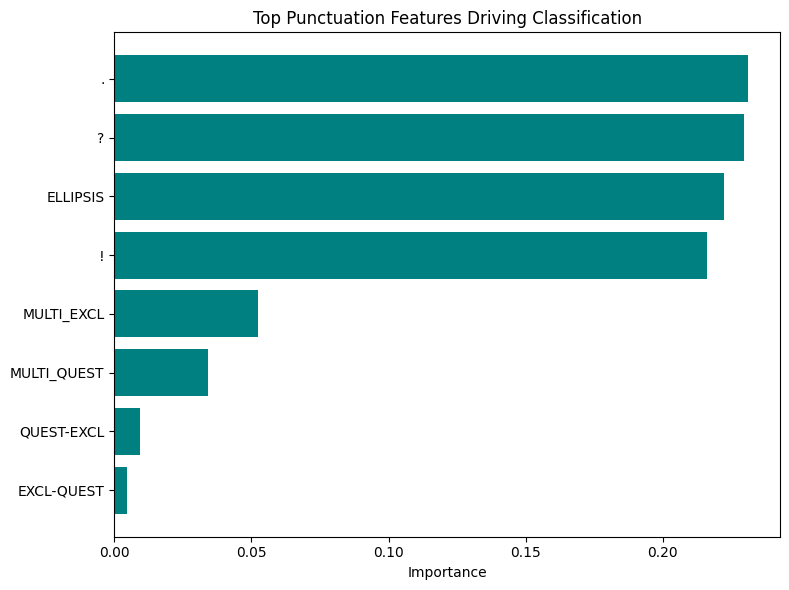
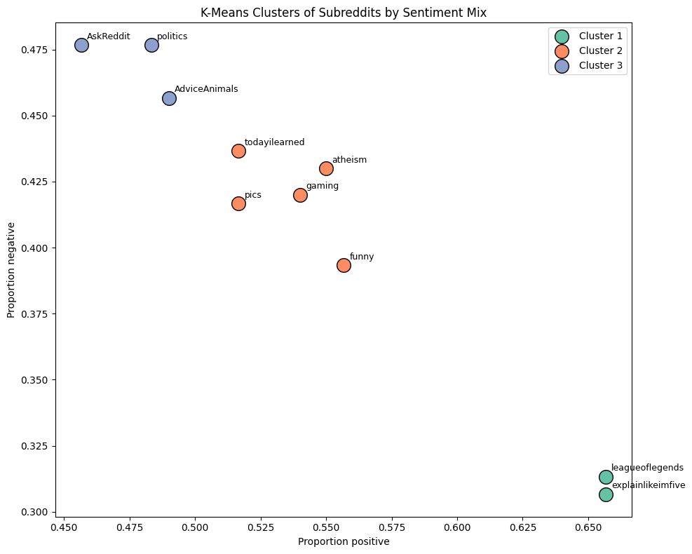
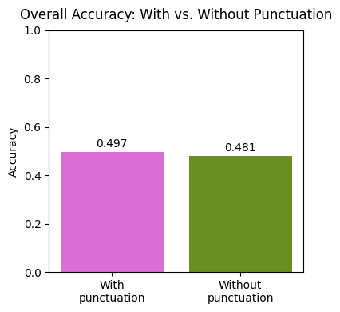
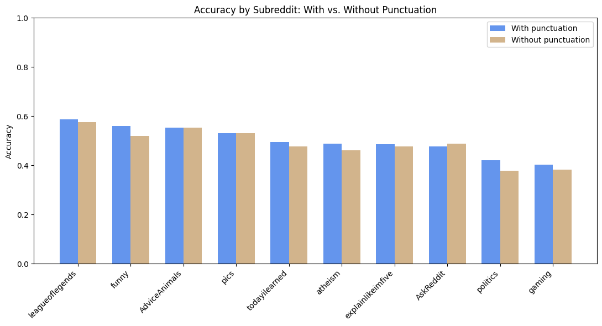

# What???...Punctuation!!!

Group members: Deanne Julia Luis, Oksana Melnyk 
## Introduction

In everyday life our communication is filled with emotions which are expressed not only verbally through words but also through prosodic cues such as intonation and pitch as well as non-verbally through facial expressions, gestures or posture. However, with the spread of technologies, an increasing amount of everyday communication has moved into online space as informal written interaction. Between late 1990s and 2026 online communication changed drastically from a specialised channel of communications used by technologically privileged groups into a mass means of communication accessible to a larger part (75%) of the world’s population (Statistics, n.d.). 

Picture 1. Individual using the Internet, 2006-2026. Source: Statistics, n.d.

The need to express your emotions in written digital communication has not disappeared so new means for it have been developed, such es emoticons or existing means have acquired a new pragmatic function such as punctuation marks. Punctuation has become “a device for organizing written interactions sequentially and establishing shared meanings between participants” (Busch, 2021, p. 2).

While traditionally punctuation is removed during preprocessing in natural language processing tasks to simplify textual data, this can discard important information necessary for deep language understanding. In addition to its grammatical and communicative functions, punctuation may provide insight into stylistic features associated with particular authors and genres. It is considered as a ‘supra-linguistic’ representational system which is not fully and may never be standardised (Darmon et al., 2021, p. 1072). From this perspective, the detection of characteristic punctuation patterns through quantitative analysis may reveal information about emotional context, authorship, or communicative style. Such an approach belongs to stylometry, as it treats punctuation as a measurable feature of textual style (Darmon et al., 2021, p. 1070).

Punctuation patterns in Reddit topics are the focus of this project. In our project we want to investigate *how reddit topics differ in their use of expressive punctuation*. In order to answer this question, we first *identify punctuation patterns across subreddits (research question (RQ) 1)*. We consider subreddits as proxies for Reddit topics, assuming that each subreddit broadly represents a specific thematic community or area of discussion. Secondly, we examine *whether punctuation features can predict community specific topics or subreddit categories (RQ2)*. Finally, we analyse *what expressive functions these punctuation patters may indicate (RQ3)*.

## Theoretical Framework

Punctuation marks serve as graphic cues of emotional expressiveness of a written digital message and positioning in digital discourse. These cues constantly develop and change to enable  the digital  expression of complex interactions between people in reality (Androutsopoulos, 2023; Busch, 2021). They can also change the valence (emotional direction) of a message (Glauch, 2025). Within our project we distinguish between conventional punctuation patterns such as periods, single exclamation marks and single question marks and repeated expressive punctuation patterns such as ellipsis, repeated exclamation marks, repeated question marks and their combinations.

### Key Expressive Punctuation Marks and Their Meanings
#### Period / Full Stop (.)

Apart from its formal function of ending a sentence or a message a period can convey a range of emotions in the digital communication. A message, which ends with a period, can signal a lower level of excitement and emphasis. It may be used to make a message more serious, thoughtful (Albritton, 2021). For a reader such a message may also appear less sincere and more annoying comparing to the same message but without a period (Gunraj et al., 2016; Reynolds et al., 2017). Especially it concerns very short messages (up to three words), for example such as “yes” (the lexical meaning of “yes” is agreement, but with a period at the end, the valence of a message is changed, it may express annoyance or seriousness, in some context even anger). In long messages over six words, a period loses its negative effect (Kemp et al., 2025).

#### Exclamation Mark (!) and Repetition (!!!)

Unlike a period, which initially had predominantly a syntactic function, an exclamation mark is considered a communicative sign, which helps to express participant's opinions and attitudes. But it has also experienced functional shifts, the most obvious change is an intended repetition (Busch, 2021, p. 6). 

The exclamation mark serves as an intensifier of an emotion expressed in a message, both positive and negative. It is assumed that the exclamation mark does not change the valence of a message (Glauch, 2025, p. 185) (e.g. “It’s funny!” does not convey any other emotion than the one expressed in the message).

Repeatability is a typical characteristic of an expressive meaning. Repeated use of the exclamation mark (!!!) does not convey redundancy, but it increases the expressive function the exclamation mark inherently has. However, it can potentially change the emotional direction of a message (Busch, 2021; Glauch, 2025). The variation of the repeated exclamation mark is the indignation mark, a combination of the exclamation mark <!> and the digit <1>, such as <!1!!>, <!!11!>, or <!!1!11>. The pragmatic meaning of this graphical cue is mocking and sarcasm (Androutsopoulos, 2023).

#### Ellipsis (...)

Traditionally, ellipsis is used for expression of omission or unfinished thought but in digital communication it may also convey hesitation, continuation or emotional distance. It creates an impression of a pause or a delayed response (Albritton, 2017). It is perceived as a neutral mark (Reynolds et al., 2017), not changing the emotional direction of a message.

Ong (2011) found out that stand-alone ellipsis marks can represent confusion, lack of understanding, or disagreement with a previous utterance, especially when they occur after an earlier sequence of explicit disagreement. The position of the ellipsis can change its pragmatic function: ellipses occur most often in the middle of contributions, where they function as general-purpose segmenters, often replacing commas or periods. Message-final ellipses, by contrast, often indicate openness, continuation, or shared background knowledge. Stand-alone ellipses can express speechlessness, disappointment, silent agreement, or interpersonal alignment (Androutsopoulos, 2020).

#### Repeated Question Marks (???)

Repeated question marks almost never convey only an interrogative character of a message but signal that the author perceives the issue as an urgent, emotionally loaded or important matter. In such context, multiple question marks can express impatience, surprise or concern (Sidi et al., 2021). They do not change the emotional direction of the message but depending on the perspective (author’s or receiver’s) it can be evaluated neutrally or negatively, showing lack of competence, disbelief, shock or anger (Kruger, 2023).

## Dataset

For this project, we used Webis-TLDR-17, available at https://huggingface.co/datasets/webis/tldr-17  as the dataset for the analysis of punctuation patterns. It comprises about 4 million content-summary pairs for the years 2006-2026 with an average length of 270 words for content and 28 words for the summary (Webis/Tldr-17· Datasets at Hugging Face, 2026). The features of the dataset include author, body, normalizedBody, content, summary, subreddit, subreddit_id. For the project, 30% of the data was used.

Text posts and web links are segregated into channels called subreddits, which cover general topics, such as finance, technology etc or specific subjects interesting only to few users. There are about 1.1 million subreddits. Users submit top-level posts in each subreddit. Other users can comment this post, supporting, expanding or contradicting the main post. The top-level post is called a submission. It consists of a title and either a link or a user-written body text (Völske et al., 2017, p. 60). We used subreddits as proxy topics for the detection of characteristics punctuation patterns of the community. In the project, the top ten subreddits were selected for the examination of distinct expressive punctuation patterns.

## Methods

### Setup 
Create the environment as shown below:

```bash
conda create --name myenv python=<version>
conda activate myenv
```

In the code folder, there is a list of dependecies in `requirements.txt` which needs to be installed as such:

```bash
pip install -r requirements.txt
```
Switch out of the code folder and then open jupyter notebook and run the code. 

### Experiments
#### Preprocessing:
To decrease runtime, the first 30% of the training data from the `Webis-TLDR-17` dataset was used. It was loaded via Hugging Face `datasets`. The subreddits were sorted in descending order and the top 10 were selected. Word level tokenization from the `nltk` module is used to split the words and punctuations as tokens. 

#### Selection of punctuations:
Base punctuations, namely periods, exclamations and question marks along with expressive patterns such as ellipses, question mark repetition, exclamation repetitions, and 2 variants of interrobangs were chosen as they represent modern online communication. These patterns were detected using `Regex patterns`.

#### Statistics:
With a maximum of 1500 posts which was chosen to reduce runtime, the frequencies of the chosen punctuations, average sentence length (with the help of a sentence tokenizer from `nltk`) and average no. of words between punctuations were calculated. This was followed by two visualizations of the frequencies per subreddit, one for the base punctuations and the other for expressive patterns.

#### Classification:
This section investigates if punctuation features predict community specific topics or subreddit categories. First we calculate the punctuation frequency per 1000 words for 1500 posts in groups of 20 for each of the subreddits. The group size is a bias/variance trade-off that was incorporated to provide more stable and meaningful results. The accuracy and precision recall for certain subreddits fluctuate due to slightly uneven distribution of posts in each subreddit. These normalization values are then averaged for a `Cosine similarity` plot to be depicted. 

**Models:**
- **Random Forest Classifier** (`n_estimators=200`, `random_state=42`): 200 decision trees
- **LinearSVC** (`random_state=42`, `max_iter=5000`)
Single stratified train/test split with a test size of 0.3 and random state of 42 is used, ensuring proportional representation of subreddits in train and test samples.

We used `Random Forest Classifier` with 200 decision trees and `Linear SVC` to see if linearity of punctuations plays a role. We then create plots for the Precision-Recall values per subreddit and the ranking of punctuations in terms of classification based on `Random Forest Classifier`’s results.  `Random Forest `'s results were chosen as the accuracy difference minimal and to create the importance plot of punctuations driving classification.

#### Sentiment Analysis:
 `VADER ` is trained on social media text and as we found it to be faster, it was chosen to conduct the Sentiment Analysis.`nltk` `VADER`’s  `SentimentIntensityAnalyzer` is used which analyses the polarity of words and assigns scores according to 3 sets of sentiments: positive,neutral and negative. A cap of 300 posts per subreddit is observed here, so the amount of posts are evenly divided and the quantity is higher which gives more data to learn. The analysis is conducted for the posts on 2 categories i.e with and without punctuations and we also use a Flipped column to observe  the difference in the sentiment prediction with and without punctuations. We used `Random Forest Classifier` again to detect the accuracy difference between these two categories. A per subreddit comparison for these 2 categories was also plotted. By their sentiment proportions, the subreddits were then grouped into 3 clusters using `k-means` which easily organizes the subreddits into clusters. We also investigate the dominant sentiments associated with each of the chosen punctuations and the patterns based on this dataset which is stored in a `Dataframe `.

## Results and Discussion

In order to answer the research question how reddit topics differ in their use of expressive punctuation, firstly, we calculated the frequencies and analysed the punctuation patterns in the selected subreddits (RQ1). After it, we worked on predicting the subreddits using different classifiers (RQ2). Finally, we conducted sentiment analysis of the subreddits including and excluding the detected punctuation patterns (RQ3).

### Frequencies and punctuation patterns

As the first step, the frequencies per 1500 posts per subreddit were calculated to identify the punctuation patterns in the top ten subreddits. The subreddit r/leagueoflegends has the longest average sentence length with 20.07 words per sentence. It is followed by r/politics (19.78 words) and r/explainlikeimfive (19.66 words). Since r/leagueoflegends has the longest average sentence length, it can be partly an explanation why it has the lowest number of total punctuation marks and total number of expressive punctuation marks per 1500 posts. However, surprisingly r/politics, having also a relatively long average sentence length, has the third highest number of expressive punctuation marks per 1500 posts which may indicate a more emotional character of contributions. 

The period is the most frequently used punctuation mark in all subreddits (see Picture 2). Since we have not analysed the length of sentences in which the period is used we cannot claim that it carries any additional pragmatic function beyond from its primary syntactic function of marking sentence boundaries. The single question mark is the second most often used punctuation mark in all subreddits. The subreddits r/atheism and r/politics show the highest usage of the single question mark, which is an interesting finding, indicating that contributions in these subreddits more often have an interrogative character in comparison with the contributions in other subreddits. On the contrary, r/explainlikeimfive and r/askreddit use the single question mark the least frequently. Single exclamation marks mostly occur in subreddits r/askReddit, r/funny and r/pics, while r/leagueoflegends, r/atheism and r/politics show the lowest usage of the single exclamation mark, indicating the lower emotional degree of contributions in these subreddits.


Picture 2. Distribution of base punctuation patterns across subreddits

Among all expressive punctuation marks, the ellipsis has the highest frequency across the ten subreddits we selected. In comparison with other expressive punctuation marks, its use is disproportionately high (see Picture 3). A possible explanation is that the ellipsis may serve as a general-purpose segmenter, replacing more traditional punctuation marks such as commas and periods. The highest frequencies occur in the subreddits r/atheism, r/politics and r/leagueoflegends. This active use of the ellipsis may be partly explained by topics of these subreddits, signalling hesitation, delayed response, continuation or shared background knowledge if used at the end of a contribution. Since the data was collected from 2006 till 2016, the pragmatical usage of the ellipsis might also change between different generations. However, there are no reliable studies on the generation gaps in using the ellipsis. The repeated exclamation marks occur most frequently in the subreddits r/AskReddit and r/funny, which may indicate an elevated level of emotional intensity in these contributions. The repeated question marks are most frequently used in the subreddits r/pics, r/funny, r/gaming and r/politics. This may indicate a higher emotional involvement in these communities associated with impatience, surprise or concern. The combinations of exclamation and question marks rarely occur only the subreddits r/pics and r/gaming.


Picture 3. Distribution of expressive patterns across subreddits

## Predicting the subreddits

*Cosine similarity*

Cosine similarity helped us to examine the similarity of punctuation patterns between the subreddits. After defining the average punctuation profile for each subreddit, cosine similarity was calculated by group means and plotted in a similarity matrix (see Picture 4). Overall, the punctuation patterns show very high cosine similarity scores, with the lowest value being 0.9988 and the highest value being 1.000. This indicates that the top ten subreddits do not differ strongly in their punctuation profiles but rather in the frequency of punctuation use. High cosine similarity may be also caused by the dominance of one or two features over the vector, such as periods and ellipses. Since all subreddits have very high proportion of periods and ellipses, so all vectors may look similar. 



Picture 4. Cosine similarity matrix

*Classification*

The classification was performed using both models The Random Forest Classifier and The LinearSVC classifier. The accuracy of the Random Forest Classifier is 0.1911. The LinearSVC classifier shows a slightly better accuracy of 0.2267. Since the dataset has ten subreddits with a relatively balanced test examples, a random baseline is approximately 0.10. This means that both classifiers only slightly better perform above the chance level. This result can be interpreted in line with the high scores of cosine similarity: the selected subreddits do contain some subreddit-specific punctuation information but their punctuation profiles are not distinctive enough to reliably predict subreddits.

The comparison of scores across the ten subreddits suggests that some subreddits have more recognisable punctuation patterns than the others. In the Random Forest Classifier, the subreddits r/AskReddit, r/politics and r/explainlikeiamfive have the highest values of precision (0.29, 0.28, 0.23), recall (0.41, 0.32, 0.30) and F1 (0.34, 0.30 and 0.26 respectively), indicating that they have more distinctive punctuation profiles than other subreddits (see Plot 4). Such subreddits as r/funny and r/todayilearned have very low precision (0.07 and 0.11), recall (0.04 and 0.04) and F1-scores (0.05 and 0.06 respectively), suggesting that the classifier mostly cannot distinguish them from other subreddits. The Linear SVS classifier performs slightly better than the Random Forest classifier, achieving accuracy of 0.2267. The better performance of the Linear SVC classifier indicates that the selected punctuation patterns are slightly more linearly separable. Linear SVC is also less sensitive to noisy data because it uses a linear decision boundaries. The subreddits r/atheism, r/ explainlikeimfive and r/AskReddit achieve the highest precision (0.28, 0.25 and 0.21), recall (0.48, 0.57 and 0.45) and F1 scores (0.35, 0.34 and 0.29 respectively), while the model fails to classify the subreddits r/AdviceAnimals and r/todayilearned, both having 0.00 scores in all classification metrics.

Based on the classification results, it can be concluded that punctuation features have weak predictive power for subreddit classification. This may partly be explained by the fact that the main punctuation features driving classification are periods, single question marks, ellipses and single exclamation marks (see Picture 5). Except for ellipses these features do not belong to strong expressive patterns but rather have conventional and basic expressive functions. 



Picture 5. Main punctuation features driving classification

### Sentiment analysis

We clustered the subreddits by sentiment mix using k-means clustering (see Picture 6). As a result, three clustered were created: a cluster with the dominant negative sentiment (r/AskReddti, r/politics and r/AdviceAnimals); a cluster with the dominant positive sentiment (r/legueoflegends and r/explainlikeiamfive) and a cluster with the subreddits in the middle between those two clusters (r/todayilearned, r/pics, r/atheism, r/pics, r/gaming and r/funny). 



Picture 6. Sentiment clusters by subreddit

Our experiment with the sentiment prediction with and without punctuation shows that punctuation has a limited influence on sentiment classification. Punctuation changed the sentiment labels only in approximately 3% of ‘Flipped’ cases. We repeated the classification with the Random Forest Classifier using sentiment labels predicted with sentiments with punctuation and without. The overall accuracy with punctuation was 0.497 and without 0.481, giving the difference of 0.016 (see Picture 7). 



Picture 7. Overall accuracy with and without punctuation

This result is consistent with the previous findings that only 3% of cases changed their sentiment labels after punctuation was removed. 

The classification accuracy by subreddit shows that the effect of punctuation is not uniform across the selected communities. In some subreddits punctuation helped the classifier perform better in the sentiment-based prediction (e.g. r/funny, r/atheism, and r/politics), while in other subreddits this effect was absent or the model performed even better without punctuation (e.g. r/AskReddit) (see Picture 8).



Picture 8. Accuracy per subreddit with and without punctuation

## Conclusion

Our project about expressive punctuation patterns across subreddits showed that the quantitative analysis of these patterns can provide meaningful insights into subreddit-specific styles, emotional involvement and communicative practices. However, these patterns are not strong enough to reliably classify subreddits or considerably change sentiment labels. 

We discovered that the dominant punctuation marks across all 10 subreddits are periods from the base punctuation and ellipses from the expressive punctuation patterns. Some subreddits use more frequently expressive punctuation, while the others rely more on base punctuation marks. r/AskReddit and r/funny used more repeated exclamation marks, while repeated question marks occurred more frequently in r/pics, r/funny, r/gaming, and r/politics. These findings suggest that the different subreddits show slightly different levels of emotional expressiveness and involvement. However, the cosine similarity matrix clearly shows that still generally the punctuation profiles are very similar in all 10 selected subreddits. The classification with the Random Forest Classifier and the Linear SVS classifier confirms that these profiles have very weak predictive power. The sentiment analysis led to the similar conclusion that punctuation hardly changes the sentiment label and has limited influence on the sentiment-based classification. 

The further research is necessary on use of broader range of punctuation marks and emoticons in online written communication. There is also a need for research on the generation gap in use of expressive punctuation in the digital environment. 

Generally, we can conclude that punctuation may provide meaningful information in NLP tasks, especially if it is combined with lexical, syntactical or pragmatic analysis. 


## Contributions

| Team Member        | Contributions                                                                            |
|--------------------|------------------------------------------------------------------------------------------|
| Deanne Julia Luis    | Preprocessing, Visualization, Statistics Calculation, Classification, Sentiment Analysis                          |
| Oksana Melnyk  | Introduction, Literature Research, Deciding Approaches and Plots, Results Description, Conclusion |

## References
- Albritton, A. (2017). A Rhetorical Model of Punctuation Mark Function in Computer-Mediated Communication. International Journal of Linguistics, Literature and Culture, 4(1), 17–29.
- Albritton, A. (2021). What’s the Point? A Study of Full-Stop Use in Text Messages in Varying Emotional Contexts. Online Journal of Communication and Media Technologies, 12(1), e202203. https://doi.org/10.30935/ojcmt/11431
- Androutsopoulos, J. (2020). Auslassungspunkte in der schriftbasierten Interaktion. In J. Androutsopoulos & F. Busch (Eds), Register des Graphischen (pp. 133–158). De Gruyter. https://doi.org/10.1515/9783110673241-006
- Androutsopoulos, J. (2023). Punctuating the other: Graphic cues, voice, and positioning in digital discourse. Language & Communication, 88, 141–152. https://doi.org/10.1016/j.langcom.2022.11.004
- Busch, F. (2021). The interactional principle in digital punctuation. Discourse, Context & Media, 40, 100481. https://doi.org/10.1016/j.dcm.2021.100481
- Darmon, A. N. M., Bazzi, M., Howison, S. D., & Porter, M. A. (2021). Pull out all the stops: Textual analysis via punctuation sequences. European Journal of Applied Mathematics, 32(6), 1069–1105. https://doi.org/10.1017/S0956792520000157
- Glauch, K. (2025). Expressive punctuation: How punctuation changes the perceived valence of discourse referents in computer-mediated communication. Linguistische Berichte (LB), 2025(282), 47–81. https://doi.org/10.46771/9783967699470_2
- Gunraj, D. N., Drumm-Hewitt, A. M., Dashow, E. M., Upadhyay, S. S. N., & Klin, C. M. (2016). Texting insincerely: The role of the period in text messaging. Computers in Human Behavior, 55, 1067–1075. https://doi.org/10.1016/j.chb.2015.11.003
- Kemp, N., Kovacic, R., & Beyersmann, E. (2025). Is the period really “pissed”? The effect of punctuation and message length on perceptions in digital communication. Telematics and Informatics, 97(102241), 1–8. https://doi.org/10.1016/j.tele.2025.102241
- Kruger, L. (2023, November 30). Question marks in user-generated comments on Afrikaans websites: A corpus linguistic study - LitNet. LitNet - Die Boekehuis Met Baie Wonings. https://www.litnet.co.za/question-marks-in-user-generated-comments-on-afrikaans-websites-a-corpus-linguistic-study/
- Ong, K. (2011). Disagreement, confusion, disapproval, turn elicitation and floor holding: Actions as accomplished by ellipsis marks-only turns and blank turns in quasisynchronous chats. Discourse Studies - DISCOURSE STUD, 13, 211–234. https://doi.org/10.1177/1461445610392138
- Reynolds, K., Casarotto, B., Noviski, S., & Roche, J. M. (2017). Using punctuation as a marker of sincerity and affective convergence during texting. Proceedings of the Annual Meeting of the Cognitive Science Society, 39(0). https://escholarship.org/uc/item/6mw7v01s
- Sidi, Y., Glikson, E., & Cheshin, A. (2021). Do You Get What I Mean?!? The Undesirable Outcomes of (Ab)Using Paralinguistic Cues in Computer-Mediated Communication. Frontiers in Psychology, 12. https://doi.org/10.3389/fpsyg.2021.658844
- Statistics. (n.d.). ITU. Retrieved 21 June 2026, from https://www.itu.int:443/en/ITU-D/Statistics/pages/stat/default.aspx
- Völske, M., Potthast, M., Syed, S., & Stein, B. (2017). TL;DR: Mining Reddit to Learn Automatic Summarization. In L. Wang, J. C. K. Cheung, G. Carenini, & F. Liu (Eds), Proceedings of the Workshop on New Frontiers in Summarization (pp. 59–63). Association for Computational Linguistics. https://doi.org/10.18653/v1/W17-4508
- Webis/tldr-17 · Datasets at Hugging Face. (2026, March 1). https://huggingface.co/datasets/webis/tldr-17


